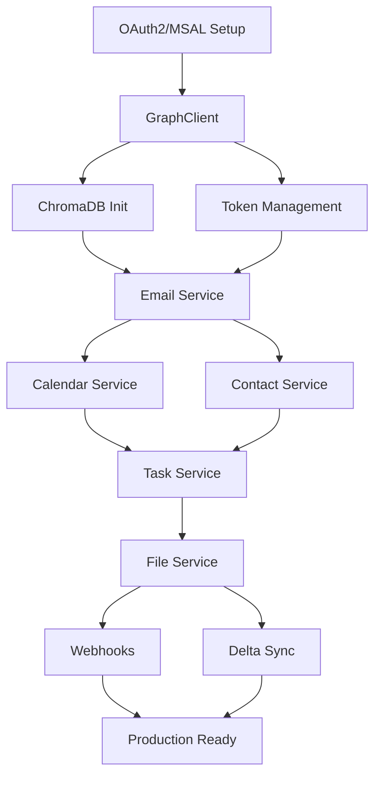

# Microsoft Graph Adapter Implementation Guide

## Overview

This document provides the comprehensive implementation plan for the Microsoft Graph adapter in the Unified PIM MCP project. It serves as the authoritative reference for development phases, technical decisions, and implementation details.

## Table of Contents

1. [Implementation Phases](#implementation-phases)
2. [Technical Architecture](#technical-architecture)
3. [ChromaDB Integration Strategy](#chromadb-integration-strategy)
4. [Development Timeline](#development-timeline)
5. [Critical Path Dependencies](#critical-path-dependencies)
6. [API Endpoints Reference](#api-endpoints-reference)
7. [Configuration Requirements](#configuration-requirements)
8. [Testing Strategy](#testing-strategy)

## Implementation Phases

### Phase 1: Foundation & Authentication (Weeks 1-2)
**Priority**: Critical Path  
**Complexity**: High  
**Dependencies**: None

#### Objectives
- Implement OAuth2 authorization code flow with PKCE
- Integrate MSAL.js for token management
- Create base GraphClient with rate limiting
- Initialize ChromaDB collections for caching

#### Deliverables
1. **OAuth2 Infrastructure**
   - MSAL-based authentication (not manual implementation)
   - PKCE flow for enhanced security
   - Integration with existing TokenManager
   - Multi-tenant support configuration

2. **Graph Client Foundation**
   ```typescript
   // src/infrastructure/adapters/microsoft/clients/GraphClient.ts
   export class GraphClient {
     constructor(
       private authProvider: MsalAuthProvider,
       private rateLimiter: RateLimiter,
       private circuitBreaker: CircuitBreaker
     ) {}
     
     async request<T>(endpoint: string, options?: RequestOptions): Promise<T> {
       // Implement with rate limiting and circuit breaker
     }
   }
   ```

3. **ChromaDB Setup**
   ```typescript
   // Collections to create
   const collections = [
     'graph-api-cache',      // Frequently accessed data
     'graph-search-index',   // Semantic search index
     'graph-metadata'        // Sync state and delta tokens
   ];
   ```

#### Success Criteria
- ✅ OAuth2 flow completes successfully
- ✅ Tokens stored securely and refresh automatically
- ✅ Basic Graph API calls work with rate limiting
- ✅ ChromaDB collections initialized

### Phase 2: Email Implementation (Weeks 2-3)
**Priority**: High  
**Complexity**: Medium  
**Dependencies**: Phase 1

#### Objectives
- Implement full EmailPort interface
- Enable semantic search for emails via ChromaDB
- Support bulk operations and delta queries
- Handle attachments efficiently

#### Key Components
```typescript
// src/infrastructure/adapters/microsoft/services/EmailService.ts
export class EmailService implements EmailPort {
  async searchEmails(options: EmailQueryOptions): Promise<EmailSearchResult> {
    // 1. Check ChromaDB cache first
    // 2. Query Graph API if needed
    // 3. Index results in ChromaDB
    // 4. Return transformed results
  }
}
```

#### Graph API Endpoints
- `GET /me/messages` - List messages
- `POST /me/sendMail` - Send email
- `GET /me/messages/{id}` - Get specific message
- `PATCH /me/messages/{id}` - Update message
- `DELETE /me/messages/{id}` - Delete message
- `POST /me/messages/{id}/reply` - Reply to message
- `GET /me/messages/delta` - Delta sync

#### ChromaDB Integration
```typescript
// Index emails for semantic search
await chroma_add_documents({
  collection_name: 'graph-search-index',
  documents: emails.map(email => email.subject + ' ' + email.body),
  metadatas: emails.map(email => ({
    type: 'email',
    id: email.id,
    from: email.from,
    date: email.receivedDateTime
  })),
  ids: emails.map(email => `email_${email.id}`)
});
```

### Phase 3: Calendar & Contacts (Weeks 3-4)
**Priority**: High  
**Complexity**: Medium  
**Dependencies**: Phase 2

#### Calendar Objectives
- CRUD operations for events
- Timezone handling
- Recurring events support
- Free/busy time calculation
- Meeting scheduling assistant

#### Calendar Graph Endpoints
- `GET /me/events` - List events
- `POST /me/events` - Create event
- `GET /me/events/{id}` - Get event
- `PATCH /me/events/{id}` - Update event
- `DELETE /me/events/{id}` - Delete event
- `GET /me/calendar/getSchedule` - Find free time
- `GET /me/events/delta` - Delta sync

#### Contacts Objectives
- CRUD operations for contacts
- Custom fields support
- Contact deduplication via ChromaDB
- Bulk import/export
- Contact groups management

#### Contacts Graph Endpoints
- `GET /me/contacts` - List contacts
- `POST /me/contacts` - Create contact
- `GET /me/contacts/{id}` - Get contact
- `PATCH /me/contacts/{id}` - Update contact
- `DELETE /me/contacts/{id}` - Delete contact
- `GET /me/contactFolders` - List folders

### Phase 4: Tasks & Files (Weeks 4-5)
**Priority**: Medium  
**Complexity**: Medium-High  
**Dependencies**: Phase 3

#### Tasks (Microsoft To Do) Objectives
- Task lists management
- Task CRUD operations
- Subtasks and dependencies
- Due dates and reminders
- Categories and priorities

#### Tasks Graph Endpoints
- `GET /me/todo/lists` - Get task lists
- `POST /me/todo/lists` - Create task list
- `GET /me/todo/lists/{listId}/tasks` - Get tasks
- `POST /me/todo/lists/{listId}/tasks` - Create task
- `PATCH /me/todo/lists/{listId}/tasks/{taskId}` - Update task

#### Files (OneDrive/SharePoint) Objectives
- File upload/download
- Folder navigation
- Large file handling (>4MB)
- Sharing and permissions
- File search via ChromaDB

#### Files Graph Endpoints
- `GET /me/drive/root/children` - List files
- `GET /me/drive/items/{item-id}` - Get file metadata
- `GET /me/drive/items/{item-id}/content` - Download file
- `PUT /me/drive/items/{item-id}:/filename:/content` - Upload file
- `POST /me/drive/items/{item-id}/createUploadSession` - Large file upload

### Phase 5: Advanced Features (Weeks 5-6)
**Priority**: Low  
**Complexity**: High  
**Dependencies**: All previous phases

#### Objectives
- Webhook subscriptions for real-time updates
- Advanced ChromaDB search across all resources
- Batch request optimization
- Performance tuning
- Comprehensive error recovery

#### Webhook Implementation
```typescript
// src/infrastructure/adapters/microsoft/services/WebhookService.ts
export class WebhookService {
  async createSubscription(resource: string, changeType: string[]): Promise<Subscription> {
    // POST /subscriptions
    return await this.graphClient.request('/subscriptions', {
      method: 'POST',
      body: {
        changeType: changeType.join(','),
        notificationUrl: process.env.WEBHOOK_URL,
        resource: resource,
        expirationDateTime: new Date(Date.now() + 3600000).toISOString()
      }
    });
  }
}
```

## Technical Architecture

### Authentication Strategy

**Decision: Use MSAL.js**

```typescript
// src/infrastructure/adapters/microsoft/auth/MsalAuthProvider.ts
import { PublicClientApplication, Configuration } from '@azure/msal-node';

const msalConfig: Configuration = {
  auth: {
    clientId: process.env.AZURE_CLIENT_ID!,
    authority: `https://login.microsoftonline.com/${process.env.AZURE_TENANT_ID}`,
    clientSecret: process.env.AZURE_CLIENT_SECRET // For confidential clients
  },
  cache: {
    cachePlugin: // Custom cache plugin for token persistence
  }
};

export class MsalAuthProvider {
  private msalInstance: PublicClientApplication;
  
  constructor() {
    this.msalInstance = new PublicClientApplication(msalConfig);
  }
  
  async acquireToken(scopes: string[]): Promise<string> {
    // Try silent first, fall back to interactive
    try {
      const result = await this.msalInstance.acquireTokenSilent({
        scopes,
        account: await this.getAccount()
      });
      return result.accessToken;
    } catch {
      return this.acquireTokenInteractive(scopes);
    }
  }
}
```

### API Strategy

**Decision: REST API over SDK**

Rationale:
- Better control over caching
- Lighter weight
- Custom error handling
- Easier ChromaDB integration

### File Structure

```
src/infrastructure/adapters/microsoft/
├── auth/
│   ├── MsalAuthProvider.ts       # MSAL authentication
│   ├── TokenRefreshService.ts    # Auto-refresh logic
│   └── AuthConfig.ts             # Auth configuration
├── clients/
│   ├── GraphClient.ts            # Base HTTP client
│   ├── RateLimiter.ts           # Rate limiting logic
│   ├── BatchRequestManager.ts   # Batch operations
│   └── CircuitBreakerClient.ts  # Circuit breaker wrapper
├── mappers/
│   ├── EmailMapper.ts           # Graph Email → Domain Email
│   ├── CalendarMapper.ts        # Graph Event → Domain Event
│   ├── ContactMapper.ts         # Graph Contact → Domain Contact
│   ├── TaskMapper.ts            # Graph Task → Domain Task
│   └── FileMapper.ts            # Graph DriveItem → Domain File
├── services/
│   ├── EmailService.ts          # Email operations
│   ├── CalendarService.ts       # Calendar operations
│   ├── ContactService.ts        # Contact operations
│   ├── TaskService.ts           # Task operations
│   ├── FileService.ts           # File operations
│   └── WebhookService.ts        # Webhook subscriptions
├── cache/
│   ├── ChromaDbCache.ts         # ChromaDB integration
│   ├── DeltaSync.ts            # Delta query handling
│   └── SemanticSearch.ts       # Search implementation
├── GraphAdapter.ts              # Main adapter class
└── index.ts                     # Module exports
```

## ChromaDB Integration Strategy

### Collections Structure

#### 1. graph-api-cache
**Purpose**: Cache frequently accessed data  
**TTL**: 5 minutes for hot data, 1 hour for warm data  
**Usage**: Reduce API calls for repeated requests

```typescript
interface CacheEntry {
  id: string;
  resource_type: 'email' | 'event' | 'contact' | 'task' | 'file';
  data: any;
  timestamp: number;
  ttl: number;
}
```

#### 2. graph-search-index
**Purpose**: Enable semantic search across all Microsoft 365 content  
**Embedding Model**: all-MiniLM-L6-v2  
**Usage**: Natural language search across emails, events, contacts, etc.

```typescript
interface SearchDocument {
  id: string;
  content: string;  // Concatenated searchable text
  metadata: {
    type: string;
    title: string;
    date: string;
    source: string;
    [key: string]: any;
  };
}
```

#### 3. graph-metadata
**Purpose**: Store sync state, delta tokens, and subscription info  
**TTL**: Persistent  
**Usage**: Maintain synchronization state between Graph and local cache

```typescript
interface MetadataEntry {
  id: string;
  type: 'delta_token' | 'subscription' | 'sync_state';
  value: any;
  last_updated: number;
}
```

### Semantic Search Implementation

```typescript
// src/infrastructure/adapters/microsoft/cache/SemanticSearch.ts
export class SemanticSearch {
  async indexContent(items: any[], type: string): Promise<void> {
    const documents = items.map(item => this.extractSearchableContent(item, type));
    
    await chroma_add_documents({
      collection_name: 'graph-search-index',
      documents: documents.map(d => d.content),
      metadatas: documents.map(d => d.metadata),
      ids: documents.map(d => d.id)
    });
  }
  
  async search(query: string, filters?: any): Promise<SearchResult[]> {
    const results = await chroma_query_documents({
      collection_name: 'graph-search-index',
      query_texts: [query],
      n_results: 20,
      where: filters
    });
    
    return this.transformResults(results);
  }
}
```

## Development Timeline

### Week 1: Foundation Setup
- [ ] Install and configure MSAL.js
- [ ] Implement MsalAuthProvider class
- [ ] Create GraphClient with rate limiting
- [ ] Initialize ChromaDB collections
- [ ] Basic error handling

### Week 2: Authentication & Email Start
- [ ] Complete OAuth2 flow testing
- [ ] Token refresh automation
- [ ] Begin EmailService implementation
- [ ] Email mapper (Graph → Domain)
- [ ] Basic email ChromaDB indexing

### Week 3: Email Completion & Calendar
- [ ] Complete email CRUD operations
- [ ] Email search with ChromaDB
- [ ] Delta sync for emails
- [ ] Start CalendarService
- [ ] Timezone handling

### Week 4: Calendar & Contacts
- [ ] Complete calendar operations
- [ ] Free/busy calculation
- [ ] Start ContactService
- [ ] Contact deduplication logic
- [ ] Cross-resource search

### Week 5: Tasks & Files
- [ ] Microsoft To Do integration
- [ ] Task list management
- [ ] OneDrive file operations
- [ ] Large file upload handling
- [ ] File metadata indexing

### Week 6: Advanced Features & Polish
- [ ] Webhook subscriptions
- [ ] Real-time sync
- [ ] Performance optimization
- [ ] Comprehensive testing
- [ ] Documentation

## Critical Path Dependencies



### Must Complete First (Critical Path)
1. **OAuth2 Authentication** - Everything depends on this
2. **GraphClient** - Base for all API calls
3. **ChromaDB Collections** - Required for caching/search
4. **Token Management** - Security foundation

### Can Be Parallelized
- Individual service implementations (after GraphClient)
- Mappers for different resource types
- Unit tests for each component
- Documentation

### Highest Risk Components
1. **OAuth2 Flow** - Complex security requirements
2. **Large File Handling** - Memory management
3. **Webhook Subscriptions** - Network reliability
4. **Delta Queries** - State management complexity

## API Endpoints Reference

### Base URL
```
https://graph.microsoft.com/v1.0
```

### Authentication Headers
```typescript
{
  'Authorization': `Bearer ${accessToken}`,
  'Content-Type': 'application/json'
}
```

### Common Query Parameters
- `$select` - Choose fields to return
- `$filter` - Filter results
- `$orderby` - Sort results
- `$top` - Limit results
- `$skip` - Pagination offset
- `$expand` - Include related resources
- `$count` - Include total count

### Rate Limits
- **Per app across all tenants**: 10,000 requests per 10 minutes
- **Per app per tenant**: 2,000 requests per 10 minutes
- **Batch requests**: Maximum 20 requests per batch

## Configuration Requirements

### Environment Variables

```bash
# Azure AD App Registration (Required)
AZURE_CLIENT_ID=your-application-id
AZURE_TENANT_ID=your-tenant-id
AZURE_CLIENT_SECRET=your-client-secret  # For confidential clients only

# API Configuration
GRAPH_API_BASE_URL=https://graph.microsoft.com/v1.0
GRAPH_API_BETA_URL=https://graph.microsoft.com/beta
GRAPH_RATE_LIMIT_PER_SECOND=10
GRAPH_BATCH_SIZE=20
GRAPH_TIMEOUT_MS=30000

# ChromaDB Configuration
CHROMADB_HOST=localhost
CHROMADB_PORT=8000
CHROMADB_COLLECTION_PREFIX=graph-
CHROMADB_EMBEDDING_MODEL=all-MiniLM-L6-v2

# Webhook Configuration (Optional)
WEBHOOK_ENDPOINT_URL=https://your-domain/api/webhooks/graph
WEBHOOK_CLIENT_STATE=your-secure-random-string

# Feature Flags
ENABLE_DELTA_SYNC=true
ENABLE_WEBHOOKS=false
ENABLE_BATCH_REQUESTS=true
ENABLE_SEMANTIC_SEARCH=true
```

### Required OAuth Scopes

```typescript
export const REQUIRED_SCOPES = [
  // User
  'User.Read',
  'User.ReadBasic.All',
  
  // Email
  'Mail.Read',
  'Mail.ReadWrite',
  'Mail.Send',
  
  // Calendar
  'Calendars.Read',
  'Calendars.ReadWrite',
  
  // Contacts
  'Contacts.Read',
  'Contacts.ReadWrite',
  
  // Tasks
  'Tasks.Read',
  'Tasks.ReadWrite',
  
  // Files
  'Files.Read',
  'Files.Read.All',
  'Files.ReadWrite',
  'Files.ReadWrite.All',
  
  // Offline Access
  'offline_access'
];

export const OPTIONAL_SCOPES = [
  // Advanced Email
  'Mail.ReadWrite.Shared',
  'Mail.Send.Shared',
  
  // Advanced Calendar
  'Calendars.Read.Shared',
  'Calendars.ReadWrite.Shared',
  
  // Sites (SharePoint)
  'Sites.Read.All',
  'Sites.ReadWrite.All',
  
  // Groups
  'Group.Read.All',
  'Group.ReadWrite.All'
];
```

### Azure AD App Registration Settings

1. **Application Type**: Public client (for desktop app)
2. **Redirect URI**: `http://localhost:3000/auth/callback`
3. **Supported Account Types**: 
   - Single tenant (for organization-specific)
   - Multi-tenant (for broader access)
4. **API Permissions**: Configure all required scopes
5. **Certificates & Secrets**: Create client secret for confidential flow

## Testing Strategy

### Unit Testing

```typescript
// src/infrastructure/adapters/microsoft/__tests__/EmailService.test.ts
describe('EmailService', () => {
  let emailService: EmailService;
  let mockGraphClient: jest.Mocked<GraphClient>;
  let mockChromaDb: jest.Mocked<ChromaDbCache>;
  
  beforeEach(() => {
    mockGraphClient = createMockGraphClient();
    mockChromaDb = createMockChromaDb();
    emailService = new EmailService(mockGraphClient, mockChromaDb);
  });
  
  describe('searchEmails', () => {
    it('should search ChromaDB cache first', async () => {
      // Test cache-first strategy
    });
    
    it('should fall back to Graph API on cache miss', async () => {
      // Test API fallback
    });
    
    it('should index results in ChromaDB', async () => {
      // Test indexing
    });
  });
});
```

### Integration Testing

```typescript
// src/infrastructure/adapters/microsoft/__tests__/integration/GraphAdapter.test.ts
describe('GraphAdapter Integration', () => {
  it('should complete full OAuth flow', async () => {
    // Test with real MSAL
  });
  
  it('should handle token refresh', async () => {
    // Test automatic refresh
  });
  
  it('should respect rate limits', async () => {
    // Test rate limiting
  });
});
```

### E2E Testing

```typescript
// tests/e2e/microsoft-graph.test.ts
describe('Microsoft Graph E2E', () => {
  it('should send and retrieve an email', async () => {
    // Full email lifecycle
  });
  
  it('should create and update a calendar event', async () => {
    // Calendar operations
  });
  
  it('should perform semantic search across resources', async () => {
    // ChromaDB search
  });
});
```

### Test Data Generation

```typescript
// tests/fixtures/graphApiResponses.ts
export const mockEmailResponse = {
  "@odata.context": "https://graph.microsoft.com/v1.0/$metadata#users('user-id')/messages",
  "value": [
    {
      "id": "AAMkAGI2...",
      "createdDateTime": "2024-01-15T12:00:00Z",
      "subject": "Test Email",
      "bodyPreview": "This is a test email",
      "from": {
        "emailAddress": {
          "name": "Sender Name",
          "address": "sender@example.com"
        }
      }
    }
  ]
};
```

## Development Workflow

### Local Development Setup

1. **Register Azure AD Application**
   ```powershell
   # Use Azure CLI or Azure Portal
   az ad app create --display-name "Unified PIM MCP Dev"
   ```

2. **Configure Environment**
   ```powershell
   # Copy and configure .env
   cp .env.example .env
   # Edit with your Azure AD app details
   ```

3. **Start Development Services**
   ```powershell
   # Start ChromaDB and other services
   npm run docker:up
   
   # Start development server
   npm run dev:microsoft
   ```

4. **Test with Graph Explorer**
   ```powershell
   # Interactive testing
   npm run graph:explorer
   ```

### Debugging Graph API Calls

```typescript
// Enable debug logging
process.env.DEBUG = 'graph:*';

// Use request interceptor
graphClient.addRequestInterceptor((request) => {
  console.log(`[Graph API] ${request.method} ${request.url}`);
  console.log('[Headers]', request.headers);
  console.log('[Body]', request.body);
  return request;
});

// Use response interceptor
graphClient.addResponseInterceptor((response) => {
  console.log(`[Graph API Response] ${response.status}`);
  console.log('[Headers]', response.headers);
  console.log('[Body]', response.body);
  return response;
});
```

### Testing with Multiple Accounts

```typescript
// src/infrastructure/adapters/microsoft/testing/MultiAccountTester.ts
export class MultiAccountTester {
  private accounts: Map<string, MsalAccount> = new Map();
  
  async addAccount(alias: string, credentials: Credentials): Promise<void> {
    const account = await this.authenticate(credentials);
    this.accounts.set(alias, account);
  }
  
  async switchAccount(alias: string): Promise<void> {
    const account = this.accounts.get(alias);
    if (!account) throw new Error(`Account ${alias} not found`);
    await this.msalInstance.setActiveAccount(account);
  }
  
  async testWithAccount(alias: string, testFn: () => Promise<void>): Promise<void> {
    await this.switchAccount(alias);
    await testFn();
  }
}
```

## Troubleshooting Guide

### Common Issues

#### 1. Authentication Failures
```typescript
// Error: AADSTS70011: The provided value for the input parameter 'scope' is not valid
// Solution: Ensure scopes are space-separated, not comma-separated
const scopes = REQUIRED_SCOPES.join(' '); // Correct
const scopes = REQUIRED_SCOPES.join(','); // Wrong
```

#### 2. Rate Limiting
```typescript
// Error: 429 Too Many Requests
// Solution: Implement exponential backoff
async function retryWithBackoff(fn: () => Promise<any>, maxRetries = 3) {
  for (let i = 0; i < maxRetries; i++) {
    try {
      return await fn();
    } catch (error) {
      if (error.status === 429 && i < maxRetries - 1) {
        const delay = Math.pow(2, i) * 1000;
        await new Promise(resolve => setTimeout(resolve, delay));
      } else {
        throw error;
      }
    }
  }
}
```

#### 3. Token Expiration
```typescript
// Error: InvalidAuthenticationToken - Access token has expired
// Solution: Implement automatic token refresh
class TokenRefreshService {
  async getValidToken(): Promise<string> {
    const token = await this.tokenManager.getToken('microsoft');
    
    if (this.isExpiringSoon(token, 5 * 60)) { // 5 minute buffer
      return await this.refreshToken();
    }
    
    return token.accessToken;
  }
}
```

#### 4. Large File Uploads
```typescript
// Error: Request body too large
// Solution: Use upload sessions for files > 4MB
async function uploadLargeFile(file: Buffer, fileName: string) {
  const uploadSession = await graphClient.request(
    `/me/drive/root:/${fileName}:/createUploadSession`,
    { method: 'POST' }
  );
  
  // Upload in chunks
  const chunkSize = 320 * 1024; // 320 KB chunks
  for (let i = 0; i < file.length; i += chunkSize) {
    const chunk = file.slice(i, Math.min(i + chunkSize, file.length));
    await uploadChunk(uploadSession.uploadUrl, chunk, i, file.length);
  }
}
```

## Performance Optimization

### Caching Strategy
1. **Memory Cache**: 5-minute TTL for hot data
2. **ChromaDB Cache**: 1-hour TTL for warm data
3. **Delta Sync**: Only fetch changes since last sync

### Batch Operations
```typescript
// Batch multiple requests
const batch = {
  requests: [
    { id: "1", method: "GET", url: "/me/messages?$top=10" },
    { id: "2", method: "GET", url: "/me/events?$top=10" },
    { id: "3", method: "GET", url: "/me/contacts?$top=10" }
  ]
};

const response = await graphClient.request('/$batch', {
  method: 'POST',
  body: batch
});
```

### Pagination Best Practices
```typescript
async function* getAllItems(endpoint: string) {
  let url = endpoint;
  
  while (url) {
    const response = await graphClient.request(url);
    yield response.value;
    
    url = response['@odata.nextLink'];
  }
}

// Usage
for await (const batch of getAllItems('/me/messages')) {
  await processMessages(batch);
}
```

## Security Considerations

### Token Storage
- Never store tokens in plain text
- Use encrypted storage with AES-256
- Implement secure key management
- Rotate encryption keys periodically

### Scope Minimization
- Request only necessary scopes
- Use least privilege principle
- Implement scope escalation when needed
- Audit scope usage regularly

### Data Protection
- Encrypt sensitive data in ChromaDB
- Implement data retention policies
- Ensure GDPR compliance
- Regular security audits

## Monitoring & Observability

### Metrics to Track
- API call count per endpoint
- Response times
- Error rates
- Token refresh frequency
- Cache hit rates
- ChromaDB query performance

### Logging Strategy
```typescript
import { Logger } from '../../../shared/logging/Logger';

class GraphAdapter {
  private logger = new Logger('GraphAdapter');
  
  async makeRequest(endpoint: string): Promise<any> {
    const start = Date.now();
    
    try {
      const result = await this.graphClient.request(endpoint);
      
      this.logger.info('Graph API request successful', {
        endpoint,
        duration: Date.now() - start,
        cached: false
      });
      
      return result;
    } catch (error) {
      this.logger.error('Graph API request failed', {
        endpoint,
        error: error.message,
        duration: Date.now() - start
      });
      
      throw error;
    }
  }
}
```

## Conclusion

This implementation guide provides a comprehensive roadmap for building the Microsoft Graph adapter. Follow the phases sequentially, ensure each phase's success criteria are met before proceeding, and maintain focus on the critical path items. The ChromaDB integration throughout will provide powerful semantic search capabilities while reducing API load through intelligent caching.